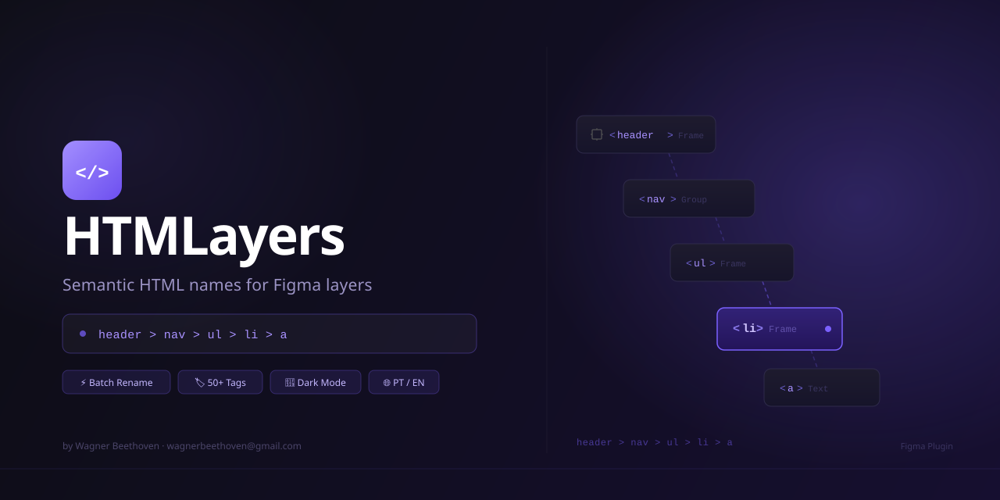

# HTMLayers

> Figma plugin — rename layers using semantic HTML tags with full hierarchy path notation.



---

## What it does

Select any layers in Figma, assign HTML tags to each one, and rename them automatically with their full hierarchical path — turning generic layer names like `Frame 47` into meaningful names like `header > nav > ul > li > a`.

```
header
header > nav
header > nav > ul
header > nav > ul > li · 1
header > nav > ul > li · 1 > a [CTA Button]
```

---

## Features

| Feature | Description |
|---|---|
| **50+ HTML tags** | Organized in 7 categories: Structural, Text, List, Interactive, Media, Table, Semantic |
| **Full hierarchy path** | Renames with complete ancestry chain |
| **Item-only mode** | Rename just the current layer without the path |
| **Batch assign** | Select multiple layers → apply the same tag to all at once |
| **Sibling numbering** | Auto-adds `· 1`, `· 2`, `· 3` to repeated tags at the same level |
| **Include original name** | Appends the original Figma layer name: `li [Card Item]` |
| **Custom separator** | Choose ` > `, ` / `, ` → `, ` . `, ` _ `, ` — ` |
| **Smart auto-detection** | TEXT layers default to `span`, shapes to `svg`, everything else to `div` |
| **Persistent tags** | Tag assignments saved per layer via `pluginData` — survive file reopens |
| **Live preview** | See the final name before committing |
| **Dark / Light mode** | Adapts automatically to Figma's theme |
| **PT-BR / EN** | Full internationalization with language switcher in the header |

---

## Screenshots

> _Add screenshots after publishing to the Figma Community._

---

## Development

### Prerequisites

- [Node.js](https://nodejs.org/) 18+
- [Figma Desktop](https://www.figma.com/downloads/)

### Setup

```bash
# Install dependencies
npm install

# Build once
npm run build

# Watch mode
npm run dev
```

### Load in Figma

1. Open **Figma Desktop**
2. Go to **Plugins → Development → Import plugin from manifest**
3. Select `manifest.json` from this directory
4. The plugin appears under **Plugins → Development → HTMLayers**

### Project structure

```
html-layers/
├── src/
│   ├── code.ts       # Plugin backend (Figma sandbox)
│   └── ui.html       # Plugin UI (webview)
├── dist/
│   └── code.js       # Compiled output (gitignored)
├── assets/
│   └── banner.svg    # Figma Community banner (1280×640)
├── manifest.json     # Figma plugin manifest
├── community.json    # Publication metadata and name suggestions
├── package.json
└── tsconfig.json
```

---

## How to use

1. **Select layers** in Figma (single or multiple, any nesting depth)
2. The plugin panel shows the layer tree with a tag dropdown per layer
3. **Assign tags** — change any dropdown to override the auto-detected tag
4. Use **toolbar options** to configure:
   - _Include original name_ → appends `[layer name]` to each segment
   - _Number siblings_ → adds `· 1`, `· 2` to repeated tags
   - _Separator_ → choose the path separator character
   - _Mode_ → full path or item-only
5. Optionally **check rows** to scope the rename to selected layers only
6. Click **Rename** — layers are renamed in place, plugin stays open

### Batch assign

Check multiple rows → a bulk bar appears at the top of the list → pick a tag → **Apply to all**.

### Undo

Figma's native **Ctrl+Z / ⌘Z** undoes all renames in a single step.

---

## Publishing to Figma Community

See [`community.json`](community.json) for:
- Recommended plugin name and 9 alternatives
- Category, tags, and descriptions (PT-BR + EN)
- Step-by-step publish checklist

**Before publishing:**
1. Generate a unique plugin ID in Figma Desktop → copy it into `manifest.json` replacing `REPLACE_WITH_YOUR_PLUGIN_ID`
2. Run `npm run build` to compile `dist/code.js`
3. Test batch rename on a file with at least 3 levels of nesting
4. Export `assets/banner.svg` to PNG at 2× for the cover image

---

## Tech stack

| | |
|---|---|
| **Language** | TypeScript |
| **Build** | `tsc` (no bundler) |
| **UI** | Vanilla HTML/CSS/JS — single file, no framework |
| **Plugin API** | Figma Plugin API v1, `dynamic-page` access |
| **Theming** | Figma CSS variables (`--figma-color-*`) + `prefers-color-scheme` fallbacks |
| **i18n** | Inline translation map, `data-i18n` attributes |

---

## License

MIT © [Wagner Beethoven](https://github.com/wagnerbeethoven)
