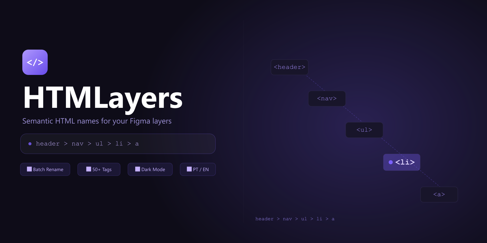

# HTMLayers

> Figma plugin — rename layers using semantic HTML tags with full hierarchy path notation.



🔗 [Figma Community](https://www.figma.com/community/plugin/1642298458655026735) · [linktr.ee/wagnerbeethoven](https://linktr.ee/wagnerbeethoven)

---

## What it does

Turn generic names like `Frame 47` into meaningful names like `header > nav > ul > li > a` — directly in Figma.

Select layers, assign HTML tags, and rename everything in one click. The plugin automatically generates the full hierarchical path based on parent elements.

```
header
header > nav
header > nav > ul
header > nav > ul > li · 1
header > nav > ul > li · 1 > a [CTA Button]
```

---

## Features

| Feature | Description |
|---|---|
| **50+ HTML tags** | Organized in 7 categories: Structural, Text, List, Interactive, Media, Table, Semantic |
| **Full hierarchy path** | Renames with complete ancestry chain |
| **Item-only mode** | Rename just the current layer without the path |
| **Batch assign** | Select multiple layers → apply the same tag to all at once |
| **Sibling numbering** | Auto-adds `· 1`, `· 2`, `· 3` to repeated tags at the same level |
| **Include original name** | Appends the original Figma layer name: `li [Card Item]` |
| **Custom separator** | Choose ` > `, ` / `, ` → `, ` . `, ` _ `, ` — ` |
| **Smart auto-detection** | TEXT → `span`, shapes → `svg`, everything else → `div` |
| **Persistent tags** | Assignments saved per layer via `pluginData` — survive file reopens |
| **Live preview** | See the final name before renaming |
| **Dark / Light mode** | Adapts automatically to Figma's theme |
| **PT-BR / EN** | Full i18n with language switcher in the header |

---

## How to use

1. **Select layers** in Figma (single or multiple, any nesting depth)
2. Plugin shows the layer tree with a tag dropdown per row
3. **Assign tags** — override the auto-detected tag for any layer
4. Configure via toolbar:
   - **Mode** — full hierarchy path or item-only
   - **Separator** — ` > ` ` / ` ` → ` ` . ` ` _ ` ` — ` (disabled in item-only mode)
   - **Include original name** — appends `[layer name]` to each segment
   - **Number siblings** — adds `· 1`, `· 2` to repeated tags at the same level
5. **Check rows** to scope the rename to selected layers only
6. Click **Rename** — plugin stays open, shows a success toast

### Batch assign

Check multiple rows → bulk bar appears → pick a tag → **Apply to all**.

### Undo

Figma's native **Ctrl+Z / ⌘Z** undoes all renames in a single step.

---

## Development

### Prerequisites

- [Node.js](https://nodejs.org/) 18+
- [Figma Desktop](https://www.figma.com/downloads/)

### Setup

```bash
npm install     # install dependencies
npm run build   # compile src/code.ts → dist/code.js
npm run dev     # watch mode
```

### Load in Figma

1. Open **Figma Desktop**
2. **Plugins → Development → Import plugin from manifest**
3. Select `manifest.json`
4. Plugin appears under **Plugins → Development → HTMLayers**

### Project structure

```
html-layers/
├── src/
│   ├── code.ts        # Plugin backend — Figma sandbox logic
│   └── ui.html        # Plugin UI — vanilla HTML/CSS/JS (single file)
├── dist/
│   └── code.js        # Compiled output (gitignored)
├── assets/
│   └── banner.svg     # Figma Community cover (1920×960)
├── manifest.json      # Figma plugin manifest (id: 1642298458655026735)
├── community.json     # Publication metadata, name candidates, publish guide
├── package.json
└── tsconfig.json
```

---

## Tech stack

| | |
|---|---|
| **Language** | TypeScript |
| **Build** | `tsc` — no bundler |
| **UI** | Vanilla HTML/CSS/JS, single file, zero dependencies |
| **Plugin API** | Figma Plugin API v1, `dynamic-page` document access |
| **Theming** | `--figma-color-*` CSS variables + `prefers-color-scheme` fallbacks |
| **i18n** | Inline translation map, `data-i18n` attributes, per-lang option cache |
| **Persistence** | `node.setPluginData` — only non-default tags written |

---

## License

MIT © [Wagner Beethoven](https://github.com/wagnerbeethoven)
